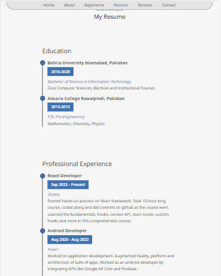
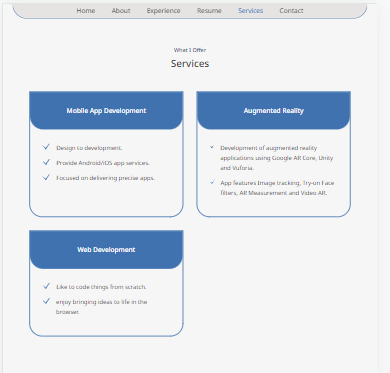
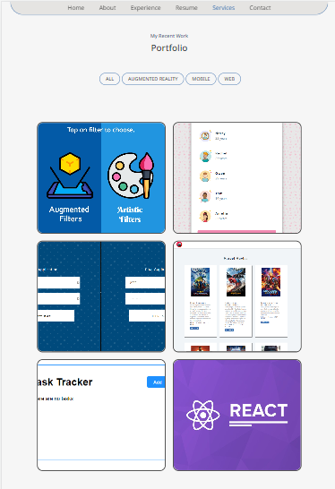
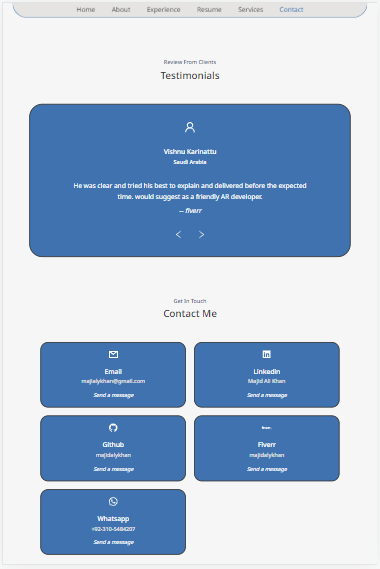

# Portfolio Project

Personal website project using React JS.
Implementation of learned concepts which are Components, Props and useState.

<h2>Screenshot</h2>

 
  
   
    
     
      
       
    

